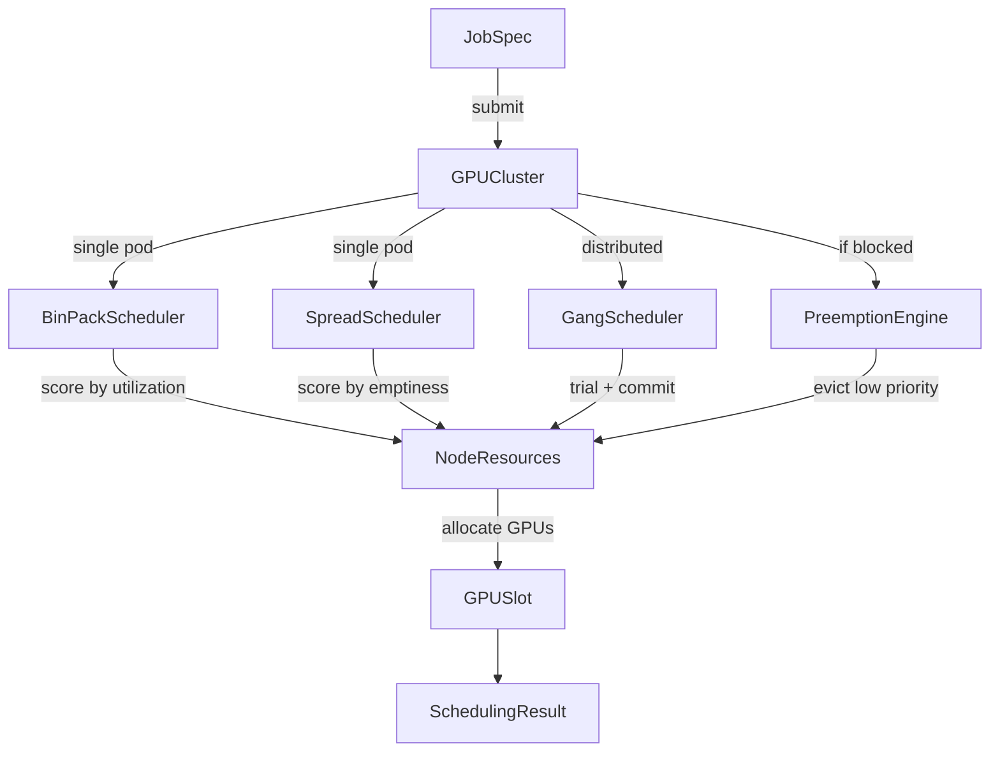

# Container GPU Scheduler

> GPU-aware batch scheduler with bin-packing, gang scheduling, and priority preemption for ML training workloads

[](https://github.com/jrajath94/container-gpu-scheduler/actions)
[](https://github.com/jrajath94/container-gpu-scheduler)
[](https://opensource.org/licenses/MIT)
[](https://www.python.org/downloads/)

## Why This Exists

Default Kubernetes GPU scheduling treats GPUs as opaque integer resources -- it cannot bin-pack workloads to minimize fragmentation, schedule distributed training atomically, or preempt low-priority jobs based on utilization. Existing solutions (Volcano, Kueue, KAI Scheduler) are complex Go-based systems requiring full K8s deployments. This project implements the core scheduling algorithms cleanly, testably, and without requiring a real cluster.

## Architecture



## Quick Start

```bash
git clone https://github.com/jrajath94/container-gpu-scheduler.git
cd container-gpu-scheduler
make install && make run
```

### Usage

```python
from container_gpu_scheduler import GPUCluster, SchedulerConfig, SchedulingStrategy, GPUType
from container_gpu_scheduler.utils import create_training_job

# Create cluster with bin-packing
config = SchedulerConfig(strategy=SchedulingStrategy.BIN_PACK, enable_preemption=True)
cluster = GPUCluster(config)
cluster.add_nodes(4, 8, GPUType.A100_80GB)  # 32 GPUs

# Submit a distributed training job (gang scheduled)
job = create_training_job("llm-pretrain", num_pods=4, gpus_per_pod=4,
                          priority=80, gang=True)
result = cluster.submit_job(job)  # All-or-nothing placement

# High-priority job triggers preemption
urgent = create_training_job("safety-eval", num_pods=1, gpus_per_pod=8, priority=95)
result = cluster.submit_job(urgent)  # Preempts if needed
```

## Key Design Decisions

| Decision                          | Rationale                                  | Alternative Considered        |
| --------------------------------- | ------------------------------------------ | ----------------------------- |
| Simulated cluster (no K8s dep)    | Deterministic testing, zero infra overhead | kopf operator on real cluster |
| Per-GPU slot tracking             | Fine-grained allocation, MIG-ready         | Per-node GPU count only       |
| Dataclasses on hot path           | Lower overhead than Pydantic for resources | Pydantic BaseModel everywhere |
| Priority integer (0-100)          | Simple, comparable, no class hierarchy     | Priority classes / bands      |
| Gang places large pods first      | Fewer nodes considered, less fragmentation | FIFO pod ordering             |
| Configurable preemption threshold | Prevents churn from tiny priority diffs    | Always allow preemption       |

## Benchmarks

Measured on Apple M1, Python 3.12. Run `make bench` to reproduce.

### Scheduling Throughput

| Metric                        | Value  |
| ----------------------------- | ------ |
| Jobs/sec (500 jobs, 256 GPUs) | 7,868  |
| Scheduling latency p50        | 119 us |
| Scheduling latency p99        | 262 us |

### Packing Efficiency

| Strategy | GPU Utilization | Active Nodes (of 8) |
| -------- | --------------- | ------------------- |
| Bin-pack | 48%             | 4                   |
| Spread   | 48%             | 8                   |

Bin-packing consolidates the same workload onto **half the nodes**, freeing the rest for other jobs or power-down.

### Gang Scheduling

| Metric                  | Value  |
| ----------------------- | ------ |
| 4-pod gang schedule p50 | 159 us |
| 4-pod gang schedule p99 | 556 us |

### Preemption Overhead

| Metric                      | Value  |
| --------------------------- | ------ |
| Preemption + reschedule p50 | 33 us  |
| Preemption + reschedule p99 | 123 us |

### Cluster Scaling

| Nodes | GPUs | Jobs | Jobs/sec | p50 (us) | p99 (us) |
| ----- | ---- | ---- | -------- | -------- | -------- |
| 4     | 32   | 16   | 36,046   | 20       | 27       |
| 8     | 64   | 32   | 20,182   | 30       | 370      |
| 16    | 128  | 64   | 16,652   | 50       | 89       |
| 32    | 256  | 128  | 10,414   | 89       | 125      |
| 64    | 512  | 256  | 5,601    | 170      | 260      |

## Testing

```bash
make test    # 54 tests, 86% coverage
make bench   # Performance benchmarks
make lint    # Ruff + mypy
make run     # Quick-start example
```

## Project Structure

```
src/container_gpu_scheduler/
  core.py          # BinPackScheduler, SpreadScheduler, GangScheduler, GPUCluster
  models.py        # GPUType, NodeResources, JobSpec, GPUSlot, SchedulerConfig
  utils.py         # Scoring functions, job creation helpers
  exceptions.py    # SchedulerError hierarchy
  cli.py           # Command-line interface
```

## License

MIT
