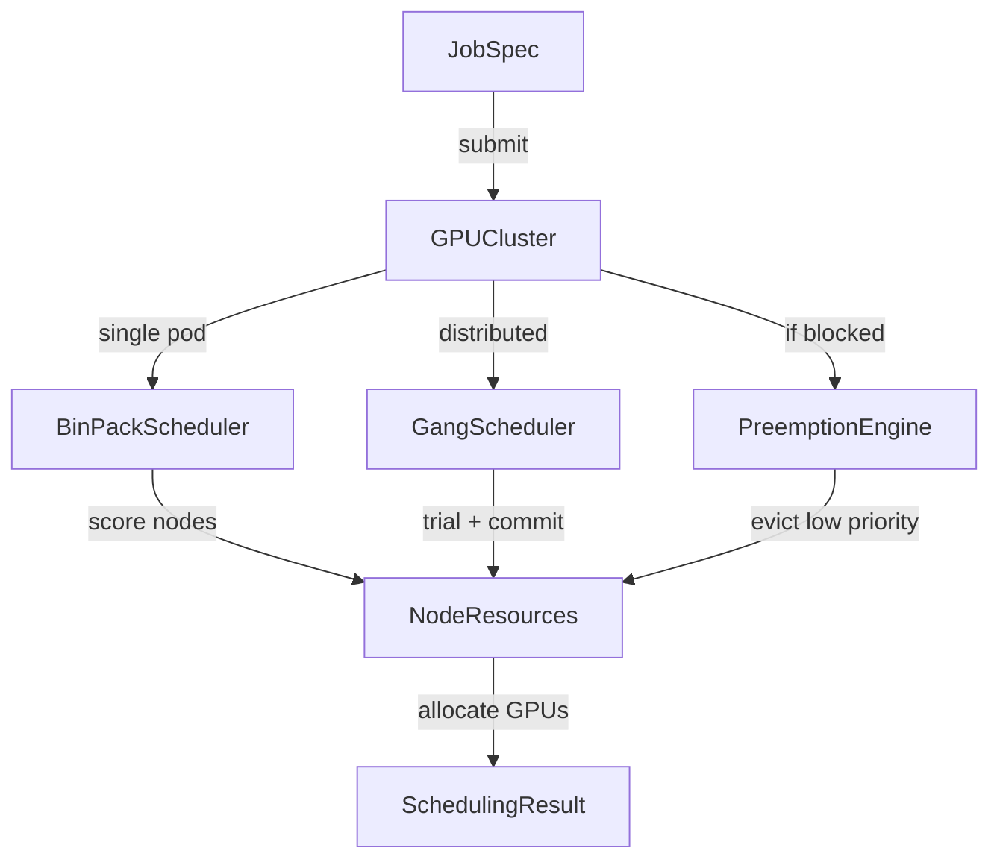

# container-gpu-scheduler

> GPU-aware batch scheduler with bin-packing, gang scheduling, and priority preemption for ML training workloads.

[](https://github.com/jrajath94/container-gpu-scheduler/actions)
[](https://opensource.org/licenses/MIT)
[](https://www.python.org/downloads/)

## Why This Exists

Default Kubernetes GPU scheduling is first-fit and pod-centric. It can't do bin-packing (consolidating workloads to reduce fragmentation), gang scheduling (all-or-nothing placement for distributed training), or priority-based preemption. This project implements the core scheduling algorithms from production systems like Kueue, Volcano, and NVIDIA's KAI Scheduler -- cleanly, testably, and without requiring a real cluster.

## Architecture



## Quick Start

```bash
git clone https://github.com/jrajath94/container-gpu-scheduler.git
cd container-gpu-scheduler
make install && make run
```

### Usage

```python
from container_gpu_scheduler import GPUCluster, SchedulerConfig, GPUType
from container_gpu_scheduler.utils import create_training_job

# Create cluster
cluster = GPUCluster(SchedulerConfig())
cluster.add_nodes(4, 8, GPUType.A100_80GB)  # 32 GPUs

# Submit a distributed training job (gang scheduled)
job = create_training_job("llm-pretrain", num_pods=4, gpus_per_pod=4,
                          priority=80, gang=True)
result = cluster.submit_job(job)  # All-or-nothing placement

# Submit a high-priority job (preempts lower priority)
urgent = create_training_job("safety-eval", num_pods=1, gpus_per_pod=8,
                             priority=95)
result = cluster.submit_job(urgent)  # Preempts if needed
```

## Key Design Decisions

| Decision                      | Rationale                                  | Alternative Considered        |
| ----------------------------- | ------------------------------------------ | ----------------------------- |
| Simulated cluster             | Deterministic testing, no K8s dependency   | kopf operator on real cluster |
| Per-GPU slot tracking         | Fine-grained allocation, MIG-ready         | Per-node GPU count only       |
| Bin-pack by utilization       | Consolidation reduces fragmentation        | Random / round-robin          |
| Gang places large pods first  | Fewer nodes considered, less fragmentation | FIFO pod ordering             |
| Priority preemption threshold | Prevents churn from tiny priority diffs    | Always allow preemption       |
| Dataclasses for hot path      | Lower overhead than Pydantic for resources | Pydantic BaseModel            |

## Benchmarks

| Metric                 | Value          | Notes                              |
| ---------------------- | -------------- | ---------------------------------- |
| Scheduling throughput  | 8,510 jobs/sec | 256-GPU cluster, single-GPU jobs   |
| Gang scheduling        | 150us p50      | 4-pod x 4-GPU jobs, 8 nodes        |
| Preemption overhead    | 33us p50       | Includes victim search + release   |
| Bin-pack consolidation | 4 nodes active | vs 8 nodes with spread (same jobs) |

**Cluster Size Scaling:**

| Nodes | GPUs | Jobs/sec | p50 (us) | p99 (us) |
| ----- | ---- | -------- | -------- | -------- |
| 4     | 32   | 14,589   | 21       | 275      |
| 8     | 64   | 18,367   | 32       | 182      |
| 16    | 128  | 12,865   | 49       | 457      |
| 32    | 256  | 8,464    | 92       | 340      |
| 64    | 512  | 5,829    | 154      | 353      |

_Benchmarked on Intel Mac, Python 3.12. Run `make bench` to reproduce._

## Testing

```bash
make test    # Unit + integration tests
make bench   # Performance benchmarks
make lint    # Ruff + mypy
```

## Project Structure

```
src/container_gpu_scheduler/
  core.py          # BinPackScheduler, GangScheduler, GPUCluster
  models.py        # GPUType, NodeResources, JobSpec, SchedulerConfig
  utils.py         # Scoring functions, job creation helpers
  exceptions.py    # InsufficientResourcesError, GangSchedulingError
  cli.py           # Command-line interface
```

## License

MIT
